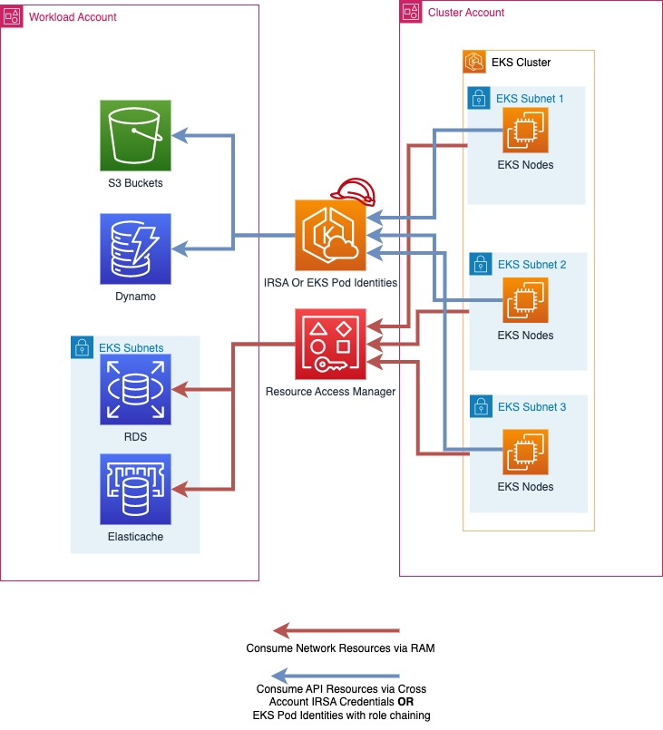

# Multi Account Strategy for Multi Tenant Clusters

AWS recommends using a [multi account strategy](https://docs.aws.amazon.com/whitepapers/latest/organizing-your-aws-environment/organizing-your-aws-environment.html) and AWS organizations to help isolate and manage your business applications and data. There are [many benefits](https://docs.aws.amazon.com/whitepapers/latest/organizing-your-aws-environment/benefits-of-using-multiple-aws-accounts.html) to using a multi account strategy.

There are many benefits to using a multi account strategy with EKS:

+ Increased AWS API service quotas. Quotas are applied to AWS accounts, and using more multiple accounts for your workloads increases the overall quota available to your workloads.
+ Simpler IAM. Granting workloads and the operators that support them access to only their own AWS accounts means less time crafting fine-grained IAM policies to acheive the principle of least privilege.
+ Improved Isolation. By design, all resources provisioned within an account are logically isolated from resources provisioned in other accounts, even within your own AWS environment. This isolation boundary provides you with a way to limit the risks of an application-related issue, misconfiguration, or malicious actions. If an issue occurs within one account, impacts to workloads contained in other accounts can be either reduced or eliminated. 
+ More benefits, as described in the [AWS Multi Account Strategy Whitepaper](https://docs.aws.amazon.com/whitepapers/latest/organizing-your-aws-environment/benefits-of-using-multiple-aws-accounts.html#group-workloads-based-on-business-purpose-and-ownership)

EKS clusters exist in a single AWS account, however using [IAM roles for Service Accounts (IRSA)](https://docs.aws.amazon.com/eks/latest/userguide/iam-roles-for-service-accounts.html) and [AWS Resource Access Manager (RAM)](https://aws.amazon.com/ram/) you can adapt a multi account strategy for your multi tenant EKS clusters.

## Planning for a Multi Workload Account Strategy for Multi Tenant Clusters

In a multi account AWS strategy, resources that belong to a given workload such as S3 buckets, ElastiCache clusters and DynamoDBs are all created in an AWS account that contains all the resources for that workload. These is referred to as a workload account. Deploying resources into a dedicated workload account is similar to deploying kubernetes resources into a dedicated namespace. There is no additional cost for using multiple accounts in an AWS organization.

Workload accounts can then be further broken down by software development lifecycle or other requirements if appropriate, e.g. a given workload can have a production account, a development account, or accounts for hosting instances of that workload in a specific region. [More information](https://docs.aws.amazon.com/whitepapers/latest/organizing-your-aws-environment/organizing-workload-oriented-ous.html) is available in this AWS whitepaper.

When implimenting a multi workload account strategy for your multi tenant EKS clusters, your EKS cluster will be deployed into an account called the Cluster Account. The cluster account will contain the VPC, subnets, EKS cluster, EC2/Fargate compute resources, and any additional networking or configurations needed to run your EKS cluster.

## Implimenting a Multi Workload Account Strategy for Multi Tenant Clusters

### Sharing Subnets With AWS Resource Access Manager 

AWS Resource Resource Access Manager (RAM) allows you to share resources across AWS accounts. 

If RAM is enabled for your AWS Organization, you can share the VPC Subnets from the Cluster account to your workload accounts. This will allow AWS resources owned by your workload accounts, such as ElastiCache Clusters or RDS DBs to be deployed into the same VPC as your EKS cluster, and be consumable by the workloads running on your EKS cluster.

To share a resource via RAM, open up RAM in the AWS console of the cluster account and select "Resource Shares" and "Create Resource Share". Name your Resource Share and Select the subnets you want to share. Select Next again and enter the 12 digit account IDs for the workload accounts you wish to share the subnets with, select next again, and click Create resource share to finish. After this step, the workload account can deploy resources into those subnets.

## Accessing AWS API Resources with IAM Roles For Service Accounts
 
[IAM Roles for Service Accounts (IRSA)](https://docs.aws.amazon.com/eks/latest/userguide/iam-roles-for-service-accounts.html) allows you to deliver temporary AWS credentials to your workloads running on EKS. IRSA can be used to get temporary credentials for IAM roles in the workload accounts from the cluster account. This allows your workloads running on your EKS clusters in the cluster account to consume AWS API resources, such as S3 buckets hosted in the workload account seemlessly, and use IAM authentication for resources like AWS RDS Databases or AWS EFS FileSystems. 

AWS API resources and other Resources that use IAM authentication in a workload account can only be accessed by credentials for IAM roles in that same workload account, except where cross account access is capable and has been explicity enabled.

### Enabling IRSA for cross account access

To enable IRSA for workloads in your Cluster Account to access resources in your Workload accounts, you first must create an IAM OIDC identity provider in your workload account. This can be done with the same procedure for setting up IRSA, except the Identity Provider will be created in the workload account: https://docs.aws.amazon.com/eks/latest/userguide/enable-iam-roles-for-service-accounts.html

Then when configuring IRSA for your workloads on EKS, you can [follow the same steps as the documentation](https://docs.aws.amazon.com/eks/latest/userguide/associate-service-account-role.html), but use the [12 digit account id of the workload account](https://docs.aws.amazon.com/eks/latest/userguide/cross-account-access.html) as mentioned in the section "Example Create an identity provider from another account's cluster".

